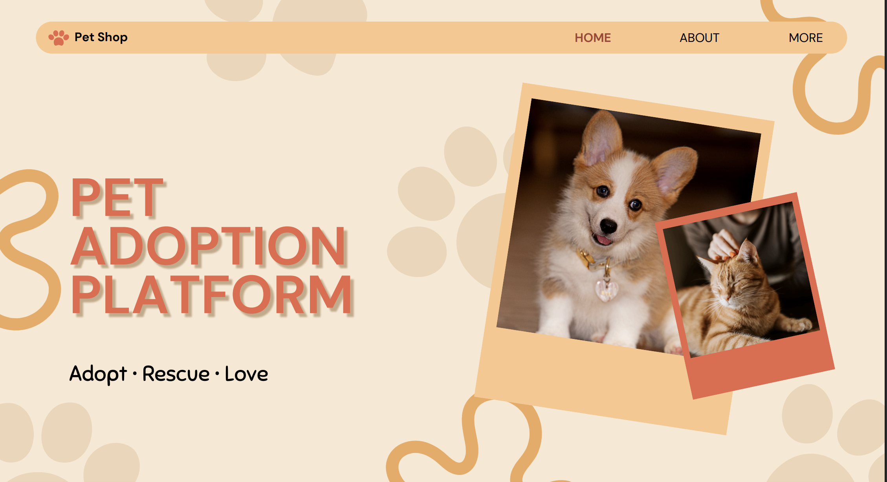
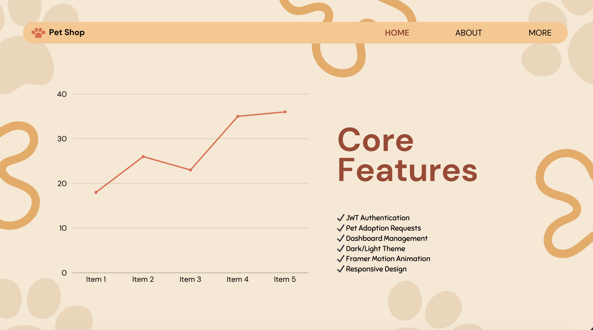

<div align="center">



# 🐾 Pet Adoption Platform

### Find Loving Homes For Every Pet ❤️

A full-stack Pet Adoption Platform where users can explore pets, submit adoption requests, manage listings, and securely handle pet adoption activities.

<br/>

[🌐 Live Website](https://assignment-9-beta.vercel.app/) • [⚙️ Server API](https://assignment-server.vercel.app/) • [💻 Client Repo](https://github.com/azizul-dev/assignment-9) • [🛠 Server Repo](https://github.com/azizul-dev/assignment-server)

</div>

---

# 📌 Project Overview

This project is a modern and responsive Pet Adoption Platform built with the MERN stack and Next.js. Users can browse pets, view detailed pet information, submit adoption requests, and manage their activities through a beautiful dashboard interface.

The platform also allows pet owners to manage listings, approve or reject adoption requests, and maintain pet availability securely using JWT Authentication and protected APIs.

---

# 🚀 Features

✅ JWT Authentication with HTTPOnly Cookies  
✅ Secure Private Routes & Protected APIs  
✅ Dynamic Featured Pets Section  
✅ Pet Details & Adoption Request System  
✅ User Dashboard Management  
✅ Add / Update / Delete Pets  
✅ Approve & Reject Adoption Requests  
✅ Advanced Search, Filter & Sorting  
✅ Dark / Light Theme Toggle  
✅ Framer Motion Animations  
✅ Fully Responsive Design  
✅ Beautiful Modern UI with Glassmorphism Effects  
✅ Custom 404 Page  
✅ Toast Notifications  
✅ Loading Spinner While Fetching Data  

---

# 🖼️ Project Preview



<br/>


<br/>


---

# 🛠️ Technologies Used

## Frontend

- Next.js 16
- React.js
- Tailwind CSS
- HeroUI
- Framer Motion
- React Icons
- React Hot Toast

---

## Backend

- Node.js
- Express.js
- MongoDB
- JWT Authentication
- Cookie Parser
- CORS

---

# 🔐 Authentication Features

- Email & Password Login/Register
- Google Authentication
- JWT Token Generation
- HTTPOnly Cookie Storage
- Protected Private Routes
- Middleware Verification

---

# 📂 Main Functionalities

## 🐶 Pet Browsing

Users can:
- Browse all available pets
- Search pets by name
- Filter pets by species
- View pet details

---

## ❤️ Adoption System

Authenticated users can:
- Submit adoption requests
- Select pickup date
- Add custom messages
- Track request status

---

## 📋 Dashboard Features

Users can:
- Manage personal requests
- Add new pets
- Edit existing listings
- Delete pets
- Approve/Reject adoption requests

---

# 📱 Responsive Design

The entire website is optimized for:

- 📱 Mobile Devices
- 💻 Laptops
- 🖥️ Desktop Screens
- 📲 Tablets

---

# 🌐 Live Links

## Client Side
👉 https://assignment-9-beta.vercel.app/

## Server Side
👉 https://assignment-server.vercel.app/

---

# 💻 GitHub Repositories

## Client Repository
👉 https://github.com/azizul-dev/assignment-9

## Server Repository
👉 https://github.com/azizul-dev/assignment-server

---

# ⚙️ Environment Variables

## Client

```env
NEXT_PUBLIC_API_URL=